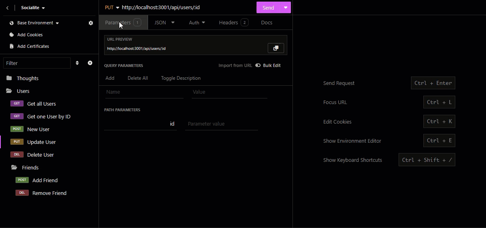

# Socialite

Socialite is a demo Express.js app designed to leverage MongoDB to emulate a Social Media service serving requests. The goal of which is to explore the utility of MongoDB and the Object-Document Mapper (ODM) Mongoose. This app was produced as part of the Coding Bootcamp from the University of Sydney and edX.

The main motivation behind this app was to further understand the process of creating, designing, populating, and manipulating a NoSQL database. This was accomplished by creating a series of routes in Express to simulate requests from a frontend or user app consuming the database as an API.

There are two core API endpoints, `/api/users` and `/api/thoughts`, which between them explore the idea of handling subdocuments as referential bodies (`friends`), or embedded subdocuments (`reactions`).

The biggest challenge in developing this app was error handling. There was a lot of effort put into creating a somewhat standardised set of helper methods in the routes particularly to catch most edge cases where possible, while minimising repeat code blocks. It does help a lot with code readability, so the effort feels worthwhile and worth exploring further in other projects and apps.

Some areas I would aim to improve in future releases:
- Support for query params instead of path parameters
- A refinement pass on the error handling to make it more informative without overexposing details
    - Additional changes to help gracefully coerce to a successful outcome if at all possible would also be nice (such as auto-populating the username if it were included but left empty in some situations)

## Table of Contents
- [Usage](#usage)
- [Installation](#installation)
- [Credits](#credits)
- [License](#license)

## Usage
When the app has been started, you can make calls to it using your browser, the fetch Web API, or any API endpoint utility such as [cURL](https://curl.se/), [Postman](https://www.postman.com/), or [Insomnia](https://insomnia.rest/) on port `3001`.

As the endpoints were predominantly tested using Insomnia, an export of the Collection has been made available [here](./docs/Insomnia_Collection.json), which includes all routes, and documentation to briefly articulate accepted parameters.

### User Routes
`[GET] /api/users` - Get all Users

`[GET] /api/users/:id` - Get one User by ID

`[POST] /api/users` - Create a new User

`[PUT] /api/users/:id` - Update a User

`[DELETE] /api/users/:id` - Delete a User

#### Friend Routes
`[POST] /api/users/:id/friends/:friendId` - Add a Friend

`[DELETE] /api/users/:id/friends/:friendId` - Remove a Friend

### Thought Routes
`[GET] /api/thoughts` - Get all Thoughts

`[GET] /api/thoughts/:id` - Get one Thought by ID

`[POST] /api/thoughts` - Create a new Thought

`[PUT] /api/thoughts/:id` - Update a Thought

`[DELETE] /api/thoughts/:id` - Delete a Thought

#### Reaction Routes
`[POST] /api/thoughts/:id/reactions/:reactionId` - Add a Reaction

`[DELETE] /api/thoughts/:id/reactions/:reactionId` - Remove a Reaction

## Installation
### Prerequisites
- [Node.js version 20 LTS or higher](https://nodejs.org/en)
- [MongoDB Community Server version 7.0.7 or higher](https://www.mongodb.com/try/download/community)
- A means of interacting with REST APIs, such as
    - [cURL](https://curl.se/)
    - [Postman](https://www.postman.com/)
    - [Insomnia](https://insomnia.rest/)
        - (Optional) Import the included [Insomnia Collection](./docs/Insomnia_Collection.json) to pre-load routes for testing

### Setup
- Clone a copy of the files to the system you wish to run this from
- From a command prompt or terminal, navigate to the directory and enter `npm install`
- Once packages have been downloaded, seed the database by running `npm run seed`
- Start the server using `npm start`
- Refer to the [Usage](#usage) section for additional guidance on the endpoints available

## Credits
### Code and Extensibility
This app was developed with the following runtimes and packages:

#### Runtimes
- [Node.js](https://nodejs.org/en)
- [MongoDB Community Server](https://www.mongodb.com/try/download/)

#### Packages
- [Express.js](https://expressjs.com/)
- [Moment.js](https://momentjs.com/)
- [MongoDB](https://www.npmjs.com/package/mongodb)
- [Mongoose](https://mongoosejs.com/)

### References
- Dummy data for email addresses generated via [Online Data Generator](https://www.onlinedatagenerator.com/home/demo)
- Random sentences used as placeholder text in both Thoughts and Reactions generated from [Random Word Generator](https://randomwordgenerator.com/sentence.php)

## License
This repository is provided under the [MIT License](./LICENSE)